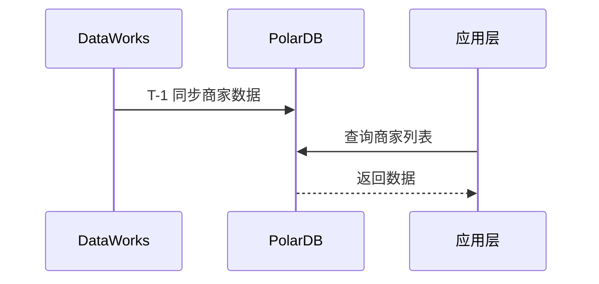

# 后端技术方案设计 Skill

## 技术栈约束

- 语言框架：Spring Boot + Java
- ORM：MyBatis-Plus
- 分层架构：Controller - Service - Mapper
- 接口风格：RESTful（主要使用 GET/POST）
- 数据库：阿里云 PolarDB / PolarDB-X 1.0/2.0
- 离线计算：阿里云 ODPS + DataWorks
- 缓存：阿里云 Redis
- 搜索：阿里云 Elasticsearch
- 消息队列：阿里云 RocketMQ
- 宽表存储：阿里云 Lindorm / HBase
- 工具库：Hutool、FastJSON

## 工作流程

根据用户请求类型选择对应流程：

**完整技术方案** → 执行步骤 1-2-3
**单独设计表结构** → 直接执行步骤 3.1
**单独设计接口** → 直接执行步骤 3.2

### 步骤 1：功能点梳理

从 PRD 中提取所有功能点，按以下顺序组织（数据流向：产出 → 存储 → 展示）。

**重要**：每个功能点必须包含完整的业务逻辑、查询规则、校验规则等细节，使用 todo list 形式展示，让开发同学可以直接对照开发，不用再翻阅需求文档。

```markdown
## 功能点清单

【后台任务】
1. XXX 数据同步任务
   1.1 圈定新商家（T-1）
   - [ ] 关联托管申请表和有偿发货量表
   - [ ] 匹配条件：托管网点托管了出港 且 商家的有偿发货网点是托管站点
   - [ ] 如果商家+发货网点不在商家表中，则新增商家
   - [ ] 记录第一次入表时间
   - [ ] 记录商家基础信息、发货网点、订单网点、托管中心等
   - [ ] 记录操作日志：操作人=system，操作类型=添加商家，内容=【网点名称（网点编号）】监控到新商家

   1.2 更新商家状态（T-1）
   - [ ] 如果发货网点结束托管（最新的有效出港申请中不存在该发货网点）
     - [ ] 将商家+网点关系状态设置为：停止服务
     - [ ] 记录操作日志：操作类型=停止服务，内容=【网点名称（网点编号）】托管申请终止，停止商家服务
   - [ ] 如果发货网点未结束关系，但托管中心有调整
     - [ ] 更新关系表中的托管中心
     - [ ] 记录操作日志：操作类型=调整托管中心，内容=托管关系调整，托管中心变更为XXX

   1.3 同步发货量（T-1）
   - [ ] 按商家统计所有发货量之和（不限制发货网点是否为托管网点）
   - [ ] 记录商家在托管网点的每日托管发货量
   - [ ] 当商家当天没有发货量时，记录为0
   - [ ] 更新商家+发货网点的最后发货日期（当发货量不为0时更新）

【页面功能】
2. 商家列表页
   2.1 条件查询
   - [ ] 商家名称：文本输入框，模糊查询，查询申通客户名称
   - [ ] 商家编码：文本输入框，精确查询，查询申通客户编码
   - [ ] 订单网点：网点下拉框，可查询所有网点
   - [ ] 发货网点：网点下拉框，可查询所有网点
   - [ ] 托管中心：下拉框，可选范围：南宁、吉安、内江
     - [ ] 当登录账号所属组织为2155时，默认为空
     - [ ] 当登录账号为托管中心时，默认选择对应中心（360004/360005=吉安，030096/030097=南宁，510402/510357=内江）
   - [ ] 服务状态：下拉框，默认=服务中，可选：服务中、停止服务、不服务，可清空查询全部
   - [ ] 商家平台：下拉框，可选：抖音、京东、其它、淘系、拼多多、快手
   - [ ] 最后发货时间：时间范围选择，最长查询1年

   2.2 列表展示
   - [ ] 商家名称：申通客户名称
   - [ ] 商家编码：申通客户编码
   - [ ] 服务状态：服务中、停止服务、不服务
   - [ ] 商家平台：发货平台
   - [ ] 订单网点：名称+编码
   - [ ] 发货网点：名称+编码
   - [ ] 托管中心
   - [ ] 上月日均托管量：上月日均托管发货量（月中开始有数据则取天数平均值）
   - [ ] 最后发货日期：在发货网点的最后发货时间
   - [ ] 创建时间：商家+发货网点入库时间

   2.3 添加新商家
   - [ ] 选择托管中心（必填）：下拉框，规则同查询条件
   - [ ] 选择商家（必填）：下拉框，可根据编码&商家名称检索
   - [ ] 选择发货网点（必填）：网点选择框，只能选择生效中的网点
   - [ ] 校验：发货网点不在托管生效范围时，提示「网点当前未托管，请重新选择」
   - [ ] 校验：发货网点+商家已存在时，提示「商家已存在，请不要重复添加」
   - [ ] 新增后同步托管信息：托管中心、发货平台、订单网点、服务状态=服务中
   - [ ] 新增后同步该商家历史1个月的发货量
   - [ ] 记录操作日志：操作人=当前用户，操作类型=新增商家，内容=添加新商家，托管中心为XX

3. 商家详情页
   3.1 基础信息展示
   - [ ] 商家信息、商家平台、订单网点、发货网点、托管中心、服务状态

   3.2 发货量信息
   - [ ] 展示商家在申通的所有发货量
   - [ ] 展示商家在对应发货网点的托管发货量
   - [ ] 最后更新时间：当商家停止服务时，信息不再更新
   - [ ] 统计日期：用户可调整查询时间，默认按最后更新时间倒推7天

   3.3 操作日志
   - [ ] 展示商家+发货网点的服务日志

   3.4 停止服务/开启服务
   - [ ] 只有鼠标悬停时才显示按钮
   - [ ] 服务中 → 显示【停止服务】按钮
     - [ ] 校验商家+发货网点是否在服务中，不在则提示「商家已停止，无需重复操作」
     - [ ] 弹框确认后，变更状态为：不服务
   - [ ] 不服务 → 显示【开启服务】按钮
     - [ ] 校验商家+发货网点是否在服务中，在则提示「商家在服务中，无需重复操作」
     - [ ] 校验发货网点是否在托管生效中，不在则提示「发货网点当前未托管，无法开启」
     - [ ] 弹框确认后，变更状态为：服务中
```

梳理时注意：
- 后台任务放在页面功能之前（先有数据，再有展示）
- **每个功能点必须包含完整的业务规则、校验逻辑、默认值、提示语等细节**
- **使用 todo list（- [ ]）形式，方便开发同学逐项核对**
- 完成后与用户确认是否有遗漏

### 步骤 2：数据来源分析

明确数据从哪里来、怎么来：

```markdown
## 数据来源

| 数据 | 来源表 | 同步方式 | 产出时间 | 备注 |
|-----|-------|---------|---------|-----|
| 商家发货量 | sto_pub.xxx_table | DataWorks → MySQL | T-1 凌晨 | 依赖上游表 xxx |
| 托管申请 | xxx_apply | 实时接口 | - | 调用 XX 服务 |
```

分析要点：
- 离线数据：说明 ODPS 表名、同步到哪张 MySQL 表、产出时间
- 实时数据：说明调用哪个服务/接口
- 注意上下游依赖关系

### 步骤 3：技术方案设计

#### 3.1 数据库设计

参考 [references/database-design.md](references/database-design.md) 获取表结构模板和命名规范。

核心要点：
- 主表 + 明细表 + 日志表分离
- 字段命名：snake_case（如 customer_code）
- 必备字段：id, gmt_create, gmt_modified, creator, modifier, is_deleted
- 索引设计：查询条件字段建索引，注意联合索引顺序

#### 3.2 接口设计

参考 [references/api-design.md](references/api-design.md) 获取接口模板和规范。

核心要点：
- RESTful 风格，查询用 GET，写操作用 POST
- 统一响应格式：code + message + data
- 分页参数：pageNum, pageSize
- 列表接口注明筛选条件和排序规则

#### 3.3 数据同步方案（如涉及 ODPS）

```markdown
## 数据同步方案

### 任务列表
| 任务名 | 类型 | 调度周期 | 依赖 | 产出表 |
|-------|-----|---------|-----|-------|
| sync_merchant | DataWorks | 每日 02:00 | upstream_table | app_merchant_info |

### 任务逻辑
**任务：sync_merchant**
- 输入：sto_pub.xxx_table
- 输出：app_db.merchant_info
- 逻辑：
  1. 关联托管申请表和有偿发货量表
  2. 按商家+发货网点维度聚合
  3. 增量更新到 MySQL
```

#### 3.4 业务流程图（如需要）

使用 Mermaid 语法绘制关键流程：



#### 3.5 其他设计考量

根据需求情况补充：
- **权限设计**：不同角色的数据权限（如托管中心只能看自己的数据）
- **性能预估**：数据量级、是否需要分库分表、是否需要 ES
- **操作日志**：独立日志表，记录操作人、时间、类型、内容

## 输出格式

技术方案使用 Markdown 格式输出，结构如下：

```markdown
# XXX 功能技术方案

## 一、功能点清单
[步骤 1 的输出]

## 二、数据来源
[步骤 2 的输出]

## 三、数据库设计
### 3.1 表结构
### 3.2 索引设计

## 四、接口设计
### 4.1 接口列表
### 4.2 接口详情

## 五、数据同步方案（如有）

## 六、业务流程图（如有）

## 七、其他设计
### 7.1 权限设计（如有）
### 7.2 性能考量（如有）
```
